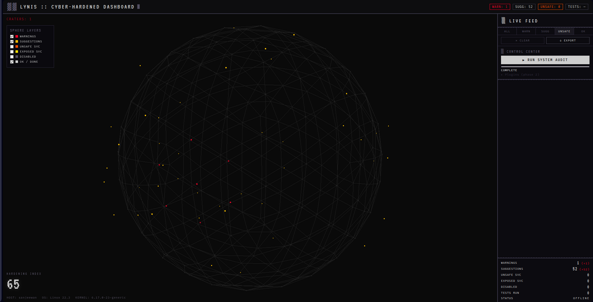

```
██╗  ██╗ █████╗ ██████╗ ██████╗ ███████╗███╗   ██╗███████╗██████╗
██║  ██║██╔══██╗██╔══██╗██╔══██╗██╔════╝████╗  ██║██╔════╝██╔══██╗
███████║███████║██████╔╝██║  ██║█████╗  ██╔██╗ ██║█████╗  ██║  ██║
██╔══██║██╔══██║██╔══██╗██║  ██║██╔══╝  ██║╚██╗██║██╔══╝  ██║  ██║
██║  ██║██║  ██║██║  ██║██████╔╝███████╗██║ ╚████║███████╗██████╔╝
╚═╝  ╚═╝╚═╝  ╚═╝╚═╝  ╚═╝╚═════╝ ╚══════╝╚═╝  ╚═══╝╚══════╝╚═════╝

    ░█▄▄░█▄█░█▄▄░█▀▀░█▀█░█░░░▀█▀░▄▀▀▄░█▀▀░█▀▀░█▀▄░░░░░░▀░
    ░█▄▄░█░█░█▄▄░██▄░█▀▄░█▄▄░░█░░░░█░░██▄░██▄░█▄▀░░░▄▄░░▄░
                                                 [ CYBER-HARDENED DASHBOARD ]
```

# LYNIS :: CYBER-HARDENED DASHBOARD

> **Real-time system hardening intelligence — visualized in 3D.**

---

## Introduction

The Lynis Cyber-Hardened Dashboard is a brutalist-aesthetic, real-time web interface that streams, parses, and renders Lynis security audit results directly onto an interactive 3D sphere — transforming raw hardening data into an immediately legible threat topology. Built for security engineers and sysadmins who demand signal over noise, it combines a WebSocket-driven event pipeline with a Three.js point-cloud visualization to expose warnings, vulnerabilities, and hardening deltas the moment Lynis emits them.

---



## Key Features

- **Real-time 3D Threat Visualization** — Lynis warnings deform the sphere geometry into craters; suggestions, vulnerabilities, unsafe services, and exposed services spike vertices outward, each in a distinct severity color. The visual state is a live spatial map of system risk.
- **Zonal Threat Mapping** — Sphere vertices are partitioned into logical security zones (Network, Kernel, Auth, File System, General). Each finding is placed in its topographically correct region, not scattered at random.
- **WebSocket Event Streaming** — A Flask-SocketIO backend streams parsed audit events to all connected clients in real time, with zero polling latency. Existing sessions receive a full `sync_dump` on reconnect.
- **Live Lynis Audit Triggering** — Initiate a full `sudo lynis audit system` run from the browser. Progress, section headers, and findings stream live as the audit executes.
- **Toggle Layers** — Individual finding types (Warnings, Suggestions, Unsafe Services, Exposed Services, Disabled, OK) can be toggled off/on without losing session state; sphere colors update immediately.
- **Vertex Tooltips** — Hover any colored vertex to inspect the exact finding text and severity type that placed it.
- **Hardening Index Overlay** — The Lynis `hardening_index` value renders as a large typographic overlay, updating live as the report is parsed.
- **CSV Export** — All warnings, suggestions, vulnerabilities, and disabled-status findings can be exported as a structured CSV with one click.
- **Pixel-Brutalist CRT Aesthetic** — Fira Code monospace typography, scanline overlay, subtle flicker animation, and a strict dark palette (`#0a0a0a` background) designed for long-session readability in terminal-adjacent environments.

---

## Tech Stack

| Layer | Technology |
|---|---|
| **3D Visualization** | [Three.js r128](https://threejs.org/) — `IcosahedronGeometry`, `Points`, `OrbitControls`, vertex color buffer |
| **Frontend Shell** | Vanilla HTML5 + CSS3 (custom pixel-brutalist design system) |
| **Typography** | Fira Code (monospace body), VT323 (display/HUD elements) via Google Fonts |
| **Real-time Transport** | [Socket.IO](https://socket.io/) (browser client) |
| **Backend Framework** | [Flask](https://flask.palletsprojects.com/) + [Flask-SocketIO](https://flask-socketio.readthedocs.io/) |
| **Async Mode** | Python `threading` (eventlet-compatible) |
| **Security Auditing** | [Lynis](https://cisofy.com/lynis/) — open-source Unix security auditing tool |
| **Report Parsing** | Python `re` (regex) — parses `/var/log/lynis-report.dat` line-by-line |
| **Process Management** | Python `subprocess` — wraps `lynis audit system` and `sudo cat` |
| **Python Runtime** | Python 3.8+ |

---

## Architecture

The dashboard follows a linear **Tail → Parse → Emit → Render** pipeline:

```
┌─────────────────────────────────────────────────────────────────┐
│                         BACKEND  (app.py)                       │
│                                                                 │
│  ┌──────────────┐    ┌──────────────┐    ┌───────────────────┐  │
│  │  Lynis Audit │───▶│  stdout/dat  │───▶│  Regex Parser     │  │
│  │  (subprocess)│    │  line reader │    │  (RE_WARN, SUGG,  │  │
│  └──────────────┘    └──────────────┘    │   VULN, UNSAFE…)  │  │
│                                          └────────┬──────────┘  │
│                                                   │             │
│                                          ┌────────▼──────────┐  │
│                                          │  audit_log (list) │  │
│                                          │  _seen dedup set  │  │
│                                          └────────┬──────────┘  │
│                                                   │             │
│                                          ┌────────▼──────────┐  │
│                                          │  SocketIO .emit() │  │
│                                          │  (warning, sugg,  │  │
│                                          │   vuln, status…)  │  │
│                                          └────────┬──────────┘  │
└───────────────────────────────────────────────────┼─────────────┘
                            WebSocket (ws://)       │
┌───────────────────────────────────────────────────▼─────────────┐
│                        FRONTEND  (index.html)                   │
│                                                                 │
│  ┌────────────────┐    ┌────────────────┐    ┌───────────────┐  │
│  │  Socket.IO     │───▶│  Event Router  │───▶│  Feed Panel   │  │
│  │  Client        │    │  (on warning,  │    │  (DOM rows)   │  │
│  └────────────────┘    │   suggestion…) │    └───────────────┘  │
│                        └───────┬────────┘                       │
│                       ┌────────▼────────┐                       │
│                       │  sphereMark()   │                       │
│                       │  (visualizer.js)│                       │
│                       └────────┬────────┘                       │
│                                │                                │
│             ┌──────────────────▼──────────────────┐             │
│             │         Three.js Scene              │             │
│             │  ┌──────────┐ ┌───────────────────┐ │             │
│             │  │ Craters  │ │  Vertex Color Buf │ │             │
│             │  │(WARNING) │ │ (SUGG/VULN/UNSAFE)│ │             │
│             │  └──────────┘ └───────────────────┘ │             │
│             └─────────────────────────────────────┘             │
└─────────────────────────────────────────────────────────────────┘
```

**Pipeline stages:**

1. **Tail** — `app.py` launches `lynis audit system` as a subprocess (or reads an existing `/var/log/lynis-report.dat`) and reads output line-by-line as it is produced.
2. **Parse** — Each line is tested against a set of compiled regex patterns. Matched lines are classified into typed events: `warning`, `suggestion`, `vulnerability`, `unsafe_service`, `exposed_service`, `hardening_index`, `tests_performed`, and system metadata.
3. **Emit** — Classified events are appended to an in-memory `audit_log` (with deduplication via a `_seen` set) and immediately pushed to all connected WebSocket clients via `socketio.emit()`. Late-connecting clients receive the full backlog via `sync_dump`.
4. **Render** — The browser's Socket.IO client routes each event to `window.sphereMark(type, text)` in `visualizer.js`. Warnings trigger geometry deformation (crater algorithm). Other findings spike vertices outward and paint them with type-specific colors from the vertex color buffer.

---

## Installation

### Prerequisites

- Linux (Debian/Ubuntu/Mint-based recommended)
- Python 3.8 or higher
- A browser with WebGL support (Chrome, Firefox, Edge)

### 1 — Install System Dependencies

```bash
sudo apt update
sudo apt install -y lynis python3-pip python3-venv
```

### 2 — Clone / Place Project Files

```bash
# If using git:
git clone https://github.com/your-org/lynis-dashboard.git
cd lynis-dashboard

# Or place files manually into a project directory:
cd /path/to/lynis-dashboard
```

### 3 — Create and Activate a Virtual Environment

```bash
python3 -m venv .venv
source .venv/bin/activate
```

### 4 — Install Python Dependencies

```bash
pip install flask flask-socketio eventlet
```

### 5 — Configure Report File Access (choose one)

The Lynis report at `/var/log/lynis-report.dat` is typically root-owned. Pick the access method that fits your security posture:

**Option A — World-readable report (simplest, lower security):**
```bash
sudo chmod o+r /var/log/lynis-report.dat
```

**Option B — Targeted sudoers rule (recommended):**
```bash
sudo visudo -f /etc/sudoers.d/lynis-dashboard
# Add the following line, replacing USERNAME with your system user:
# USERNAME ALL=(ALL) NOPASSWD: /usr/bin/cat /var/log/lynis-report.dat
```

**Option C — Run the dashboard as root (not recommended for production):**
```bash
sudo python3 app.py
```

---

## Usage

### Run a Lynis Audit

Before using the dashboard for the first time, perform at least one audit to populate the report file:

```bash
sudo lynis audit system
```

### Start the Dashboard

```bash
source .venv/bin/activate   # if not already active
python3 app.py
```

Open your browser and navigate to:

```
http://localhost:5000
```

### Interacting with the Dashboard

| Action | How |
|---|---|
| **Trigger a live audit** | Click `RUN AUDIT` in the Control Center panel. The sphere updates in real time as Lynis scans the system. |
| **Inspect a finding** | Hover over any colored vertex on the sphere. A tooltip displays the finding type and full text. |
| **Filter finding types** | Use the toggle checkboxes (Warnings, Suggestions, Unsafe, Exposed, Disabled, OK) in the top-left overlay. The sphere repaints instantly. |
| **Reset the sphere** | Click `CLEAR FEED` to wipe the event feed. Use `sphereReset()` in the browser console to fully reset sphere geometry and colors. |
| **Export findings** | Click `EXPORT CSV` in the feed utilities bar. A `lynis_audit.csv` file is downloaded containing all warnings, suggestions, vulnerabilities, and disabled-status items. |
| **Rotate / zoom the sphere** | Click and drag to orbit. Scroll to zoom. Auto-rotation is enabled by default. |

### Reading the Sphere

| Visual | Meaning |
|---|---|
| **Red crater (inward deformation)** | `WARNING` — a hardening failure requiring attention |
| **Amber spike** | `SUGGESTION` — a recommended hardening improvement |
| **Hot-pink spike (larger)** | `VULNERABILITY` — a vulnerable package detected; also triggers a crater |
| **Orange spike** | `UNSAFE SERVICE` — a systemd service with unsafe exposure |
| **Yellow spike** | `EXPOSED SERVICE` — a systemd service with network exposure |
| **Blue-gray vertex** | `DISABLED` — a security control found to be disabled or missing |
| **Green vertex** | `OK` — a passing check |
| **Blue vertex** | `INFO` — informational finding |

The large number in the bottom-left of the sphere view is the **Lynis Hardening Index** (0–100). Higher is better.

---

## Project Structure

```
lynis-dashboard/
│
├── app.py              ← Flask-SocketIO server, Lynis subprocess runner,
│                          .dat and stdout regex parsers, CSV export route
│
├── index.html          ← Frontend shell: Socket.IO client, event routing,
│                          feed panel DOM, control center, stats bar
│
├── visualizer.js       ← Three.js scene: IcosahedronGeometry sphere,
│                          crater deformation algorithm, vertex color buffer,
│                          zonal mapping, raycaster tooltips, toggle logic
│
├── styles.css          ← Pixel-brutalist design system: CRT scanlines,
│                          flicker animation, Fira Code + VT323 typography,
│                          feed item color coding, modal and tooltip styles
│
└── setup.txt           ← Plain-text quickstart and troubleshooting reference
```

---

## Troubleshooting

| Symptom | Resolution |
|---|---|
| `"Report not found"` error in feed | Run `sudo lynis audit system` first to generate `/var/log/lynis-report.dat`. |
| Sphere does not render | Open the browser console. Three.js r128 requires WebGL; verify `chrome://gpu` or `about:support` shows WebGL enabled. |
| No events arriving after audit | Confirm the report file is readable by the app user (see Installation § 5). Check that Lynis completed at least one audit section. |
| `Port 5000 already in use` | Edit the last line of `app.py`: change `port=5000` to an available port (e.g. `port=5001`), then open `http://localhost:5001`. |
| Toggle checkboxes have no effect | Ensure `applyToggles()` is wired to the `onchange` handler of each checkbox in `index.html`. |
| Audit button stays disabled | A previous audit thread may still be running. Wait for the `audit_lock` to release (status will show `ALL DATA LOADED`), or restart the server. |

---


## Contributing

Pull requests are welcome. For significant changes, open an issue first to discuss what you would like to change. Ensure any new event types added to `app.py` are reflected in both the `C` color palette and `layerVisible` map in `visualizer.js`, and that the corresponding CSS class is added to `styles.css`.

---

```
[ LINK ESTABLISHED ]  ░  HARDENING INDEX: ██  ░  CRATERS: 0  ░  MONITORING...
```
